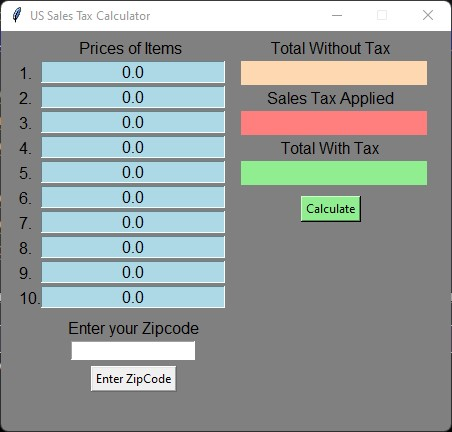

# **County Sales Tax Calculator**

## **Contributors:**
  ##### Andrew Traphagan, Athena Lee, Jacob Holback, Khushi Desai, & Rebecca Blasco.

## **Summary & Purpose:**
  ### _Original Code:_
  ##### The original code focused on an application that would calculate the sales tax applied to the item prices of a transaction that have been inputted by a user. The sales tax applied was dependent on Monterey County's sales tax rate, which allowed the code to apply the appropriate sales tax to the inputted transaction to    achieve three different results: total without tax, sales tax applied, and total with tax. These results would then be displayed within the application's interface       for the user. (Original code created by Andrew Traphagan)
  ### _Updated Code:_
  ##### Our updated code focuses on an application that calculates the sales tax applied to the item prices of a transaction that has been inputted by a user. The      sales tax applied will dependent on the county of purchase within the United States, and these counties will be presented via an API to the user for input via a postal/zip code. This will allow the code to apply the appropriate sales tax to the inputted transaction to achieve three different results: total without tax, sales tax applied, and total with tax. These results will be displayed within the application's interface for the user. (Updated code created by Andrew Traphagan, Athena Lee, Jacob Holback, Khushi Desai, & Rebecca Blasco)
  ### _Purpose:_
  ##### This new application is aimed at making it easier for users to calculate how much they are going to be spending at a physical and/or some online store          environments for their desired items rather than purchasing these items without knowing how much tax will be applied to their transaction(s).

## **Major Functions:**
  ##### Our major functions include an api, multiple def functions, multiple labels, entry boxes, and a button. Our api labeled "Taxapi" utilizes our code from our other python file, which retrieves data from a Tax database. This allows the program to find tax rates throughout every county in the United States. This also allows our program to automatically receive updates in tax rates, rather than us having to manually input them. Our first def function (def add_input) applies the tax to the costs that will be entered. Our second def function (total) gathers the inputted values of the entry boxes for the equation. Then it applies the sales tax given. This functions also utilizes our button labeled "calculate". Our final def function labeled (enterZipcode) allows the user to enter their choice of a zip code, then displays the tax rate in the zip code. this tax rate is then applied to the overall cost of items.

## **Explanations:**

## **Outside Sources:**
  ##### https://developers.taxjar.com/api/guides/python/#python-quickstart

## **Limitations:**
  ##### 1. Application design layout and formatting changes depending on the operating system of the user (Mac or Windows). 
  ##### 2. Application is limited to postal and zip codes within the United States, but does not include international codes from other countries.
  ##### 3. Application is limited to 10 items for the price list, but can later implement a scoll inoput list in the future fotr more inputs.
  ##### 4. Application can work with online purchases, but it depends on the online storefront as the application does NOT take shipping costs into account.

## **Project Host/Repository:**
  ##### https://github.com/AndrewT2013/groupproject/

## **GUI Screenshots:**
  ##### 
  
## **References:**
  ##### https://medium.com/swlh/how-to-make-the-perfect-readme-md-on-github-92ed5771c061
